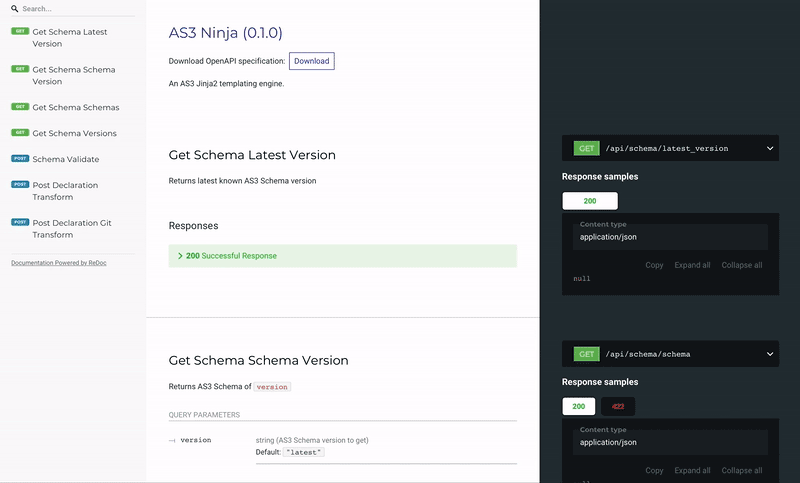
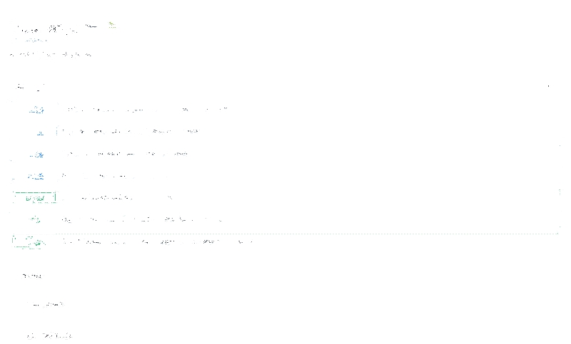

# AS3 Ninja

[](https://travis-ci.com/simonkowallik/as3ninja)[](https://codecov.io/gh/simonkowallik/as3ninja)[](https://as3ninja.readthedocs.io/en/latest/?badge=latest) [](https://microbadger.com/images/simonkowallik/as3ninja)

  - Free software: ISC license
  - Documentation: <https://as3ninja.readthedocs.io>
  - Works with Python 3.7 and up

## What is AS3 Ninja?

AS3 Ninja is a templating engine as well as a validator for
[AS3](https://github.com/F5Networks/f5-appsvcs-extension/) declarations.
It offers a CLI for local usage, as well as a OpenAPI/Swagger based REST
API.

In short, you want it in your deck\!

``` text
+---------------+
|  _            |
|  \\    ,      |
|   \\ (**)~    |
|    \\ AS3 ,%  |
|      Ninja    |
|      /   \    |
+---------------+
|  API  |  CLI  |
+---------------+
```

## Features

  - Validate your AS3 Declarations against the AS3 Schema (via API, eg.
    for CI/CD)
  - Create AS3 Declarations from templates using the full power of
    Jinja2 (CLI and API)
      - reads your JSON or YAML configurations to generate AS3
        Declarations
      - carefully crafted Jinja2 :py`as3ninja.filters` and
        :py`as3ninja.functions` further enhance the templating
        capabilities
  - Use Git(hub) to pull template configurations and declaration
    templates
  - Vault by Hashicorp is (going to be) supported to retrieve secrets
  - AS3 Ninja provides a simple CLI...
  - and a REST API including a Swagger/OpenAPI interface at `/api/docs`
    and `/api/redoc`

## AS3 Ninja Interface

Some impressions from the AS3 Ninja interfaces:

### the Command Line

as3ninja cli:



### the API UI

ReDoc and Swagger UI:



Swagger UI demo:



## Security Notes

AS3 Ninja's focus is flexibilty in templating and features, it is not
harded to run in untrusted environments.

  - It comes with a large set of dependencies, all of them might
    introduce security issues
  - Jinja2 is not using a Sandboxed Environment (yet) and the
    <span class="title-ref">readfile</span> filter allows arbitary file
    includes.
  - The API is unauthenticated (for now)

<div class="danger">

<div class="admonition-title">

Danger

</div>

Only use AS3 Ninja in a trusted environment with restricted access and
trusted input.

</div>

## Where to start?

[Read the Docs](https://as3ninja.readthedocs.io/) and then [Try it
out](https://as3ninja.readthedocs.io/en/latest/usage.html)\! :-)
