===============
Using AS3 Ninja
===============

Run AS3 Ninja with Docker
-------------------------

Starting an ephemeral/temporary container for use of the API:

.. code-block:: shell

   docker run -it --rm -p 8000:8000 simonkowallik/as3ninja

Creating a persistent container for CLI and API usage:

.. code-block:: shell

   docker container create --name as3ninja -p 8000:8000 simonkowallik/as3ninja

   # start the as3ninja container in background
   docker start -a as3ninja

.. Important::
   The AS3 Schema files need to be downloaded from github.com to validate AS3 Declarations.
   AS3 Ninja :py:meth:`as3ninja.AS3Schema.updateschemas` is doing that for you automatically,
   but the Docker Container will need access to https://github.com.

Using the CLI with Docker
^^^^^^^^^^^^^^^^^^^^^^^^^

Docker can be used to run the command line.

.. code-block:: shell

   $ tree ./examples/simple/
   ./examples/simple/
   ├── http_path_header.iRule
   ├── ninja.yaml
   ├── sorry_page.iRule
   └── template.j2

This example assumes the relevant Template Configurations and Declaration Templates are stored in ``./examples/simple``.

.. code-block:: yaml
   :linenos:
   :emphasize-lines: 2

   as3ninja:
     declaration_template: "examples/simple/template.j2"

The ``declaration_template`` statement within the ``ninja.yaml`` provides the template location as ``examples/simple/template.j2``.
as3ninja expects to find the template at this location.

.. code-block:: shell
   :linenos:
   :emphasize-lines: 2,3,4

   $ docker run --rm --tty --interactive \
       --volume \$(pwd)/examples:/examples \
       simonkowallik/as3ninja:latest \
       as3ninja transform -c /examples/simple/ninja.yaml \
       | jq ."

Instructs docker to bind mount the ``$(pwd)/examples`` folder to ``/examples`` (line 2) for the container image ``simonkowallik/as3ninja:latest`` (line 3).

Docker then executes ``as3ninja transform -c /examples/simple/ninja.yaml`` (line 4) within the container and pipes the result to ``jq .``.

.. todo:: more cli examples

Command Line Usage
------------------

.. code-block:: shell

    # for manual system wide installation (not recommended)
    $ git clone https://github.com/simonkowallik/as3ninja
    $ cd as3ninja
    $ poetry build
    $ pip3 install $(ls build/as3ninja*.whl)

.. code-block:: shell

    # via PyPI using pip
    $ pip=$(type -p pip3 || type -p pip)
    $ $pip install as3ninja

API Usage
---------

Use ``curl`` or ``httpie`` to query all available AS3 Schema versions:

.. code-block:: shell

   $ http localhost:8000/api/schema/versions

   $ curl -s localhost:8000/api/schema/versions | jq .

Navigate to `http://localhost:8000/api/docs`_ and `http://localhost:8000/api/redoc`_ to explore the API.

.. _`http://localhost:8000/api/docs`: http://localhost:8000/api/docs

.. _`http://localhost:8000/api/redoc`: http://localhost:8000/api/redoc

.. todo:: Postman collection for API calls

Validating a declaration
------------------------

Using an ephemeral container with ``docker run``:

.. code-block:: shell

    $ docker run -it --rm -v $PWD/declaration.json:/declaration.json \
        simonkowallik/as3ninja:latest \
        as3ninja validate -d /declaration.json
    INFO: Validation passed for AS3 Schema version: 3.22.1

    $ docker run -it --rm -v $PWD/declaration.json:/declaration.json \
        simonkowallik/as3ninja:latest \
        as3ninja validate -d /declaration.json --version 3.17.0
    INFO: Validation passed for AS3 Schema version: 3.17.0

Using the API via ``curl``:

.. code-block:: shell

    # start the docker container on port 8000
    docker run -d --rm -p 8000:8000 simonkowallik/as3ninja:latest
    6dd7a4a9cc65f84974a122e0605dd74fe087a7e61e67298e529bcd96fa133c7

    # POST declaration to /api/schema/validate endpoint (curl)
    curl -s http://localhost:8000/api/schema/validate -d @declaration.json | jq .
    {
      "valid": true,
      "error": null
    }

    # POST declaration to /api/schema/validate endpoint (httpie)
    cat $PWD/examples/dynamic-irule/declaration.json | \
        http POST 'localhost:8000/api/schema/validate?version=3.20.0'
    HTTP/1.1 200 OK
    content-length: 27
    content-type: application/json
    date: Sun, 13 Sep 2020 12:14:03 GMT
    server: uvicorn

    {
        "error": null,
        "valid": true
    }

Postman collection
------------------

An `AS3 Ninja Postman collection`_ is available on Github.

.. _`AS3 Ninja Postman collection`: https://raw.githubusercontent.com/simonkowallik/as3ninja/master/examples/AS3Ninja.postman_collection.json

Python Package
--------------

.. todo:: Update usage as a module

To use AS3 Ninja in your python project:

.. code-block:: python
   :linenos:

   from as3ninja.schema import AS3Schema, AS3ValidationError
   from as3ninja.declaration import AS3Declaration

   # Declaration Template (str)
   declaration_template = """
   {
       "class": "AS3",
       "declaration": {
           "class": "ADC",
           "schemaVersion": "3.11.0",
           "id": "urn:uuid:{{ uuid() }}",
           "{{ ninja.Tenantname }}": {
               "class": "Tenant"
           }
       }
   }
   """

   # Template Configuration (dict)
   template_configuration = {
       "Tenantname": "MyTenant"
   }

   # generate the AS3 Declaration
   as3declaration = AS3Declaration(
       template_configuration=template_configuration,
       declaration_template=declaration_template
       )

   from pprint import pprint
   # the transformed AS3 Declaration is available via the declaration attribute
   pprint(as3declaration.declaration)
   {'class': 'AS3',
    'declaration': {'MyTenant': {'class': 'Tenant'},
                    'class': 'ADC',
                    'id': 'urn:uuid:f3850951-4a63-43ec-b2a3-28ab2c315479',
                    'schemaVersion': '3.11.0'}}

   # create an AS3 schema instance
   as3schema = AS3Schema()

   # Validate the AS3 Declaration against the AS3 Schema (latest version)
   try:
       as3schema.validate(declaration=as3declaration.declaration)
   except AS3ValidationError:
       # an AS3ValidationError exception is raised when the validation fails
       raise
